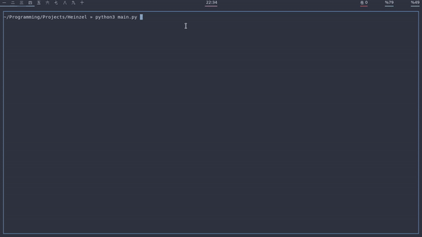

# Heinzel 

Deadly simple program menu. Tkinter is used as a gui reference.




## Installation
Install tkinter in your distro
For example ( Arch ):
```
pacman -S tk
```
then install requirements
```
pip3 install requirements.txt
```

## Usage
In Heinzel you can use modules ( `Heinzel/modules`)
To run the program normally, use `Heinzel -m run

## Why such a name, what does it mean?
Heinzel or Heinzelmännchen - in German folklore, a homely spirit, for a modest fee - a jug of milk or a saucer of cream - he will do almost all the housework: washing dishes, sweeping the floors, taking care of livestock.


So this program, like a helper spirit, helps to quickly get to work by displaying a list of programs. And unlike a magical creature, it does not even require a jug of milk.

## Features:

- nice and minimalistic interface
- lightness
- a small number of lines of code, which allows you to quickly make changes to the code base
- simple config file
